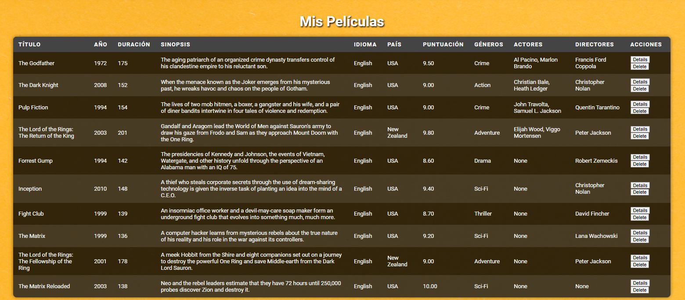
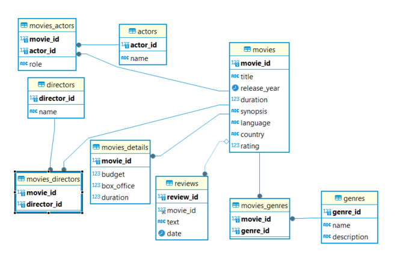

# Proyecto de Gestión de Películas
## Background
Mi nombre es Carlos Sanahuja
Mi background profesional no ha estado relacionado con la informática, pero tras una operación de espalda me comencé a reciclar profesionalmente y opté por la programación ya que es algo que me ha gustado desde siempre.
A partir de la operación de espalda he cursado los dos primeros trimestres de DAW y he realizado diversos cursos de html, CSS, Java y C+ en la plataforma Udemy.

## Imágenes de la web

## Descripción del Proyecto

La aplicación permite a los usuarios:
- **Agregar Películas**: Ingresar títulos de películas junto con su año de estreno, duración, sinopsis, idioma, país y calificación.
- **Agregar Detalles a Películas**: Añadir detalles adicionales como géneros, actores, directores, presupuesto, recaudación en taquilla, duración y reseñas.
- **Agregar Actores y Directores**: Incorporar nuevos actores y directores a la base de datos.
- **Visualización de Películas**: Ver un listado de las películas almacenadas con sus detalles básicos y acceder a detalles más profundos.
- **Eliminar Películas**: Borrar películas junto con sus relaciones en la base de datos.

## Rutas Habilitadas

### `/` : Ruta principal
- **Método**: GET
- **Descripción**: Muestra formularios para agregar películas, detalles, actores y directores, junto con una tabla que lista todas las películas con sus detalles básicos.

### `/add_movie` : Ruta para agregar una película
- **Método**: POST
- **Descripción**: Permite agregar una nueva película a la base de datos.

### `/add_details` : Ruta para agregar detalles a una película
- **Método**: POST
- **Descripción**: Permite añadir detalles adicionales a una película existente, como géneros, actores, directores, presupuesto, recaudación en taquilla, duración y reseñas.

### `/add_actor` : Ruta para agregar un actor
- **Método**: POST
- **Descripción**: Permite añadir un nuevo actor a la base de datos.

### `/add_director` : Ruta para agregar un director
- **Método**: POST
- **Descripción**: Permite añadir un nuevo director a la base de datos.

### `/movie_details/<int:movie_id>` : Ruta para obtener los detalles de una película
- **Método**: GET
- **Descripción**: Devuelve una página con detalles adicionales de una película específica, incluyendo géneros, actores, directores, presupuesto, taquilla y reseñas.

### `/delete_movie` : Ruta para eliminar una película
- **Método**: POST
- **Descripción**: Permite eliminar una película de la base de datos, junto con todas las relaciones asociadas (géneros, actores, directores, detalles y reseñas).

## Diagrama ER

El diagrama de entidades y relaciones (ER) de la base de datos es el siguiente:

## Funcionalidades de la Web

1. **Agregar Películas**: Permite añadir nuevas películas con información básica como título, año de estreno, duración, sinopsis, idioma, país y calificación.

2. **Agregar Detalles a Películas**: Permite añadir detalles adicionales a una película, incluyendo géneros, actores, directores, presupuesto, recaudación en taquilla, duración y reseñas.

3. **Agregar Actores y Directores**: Permite añadir nuevos actores y directores a la base de datos, que luego pueden ser relacionados con una o más películas.

4. **Visualización de Películas**: Muestra una lista de películas con detalles básicos, permitiendo acceder a detalles adicionales a través de un botón "Details".

5. **Eliminar Películas**: Permite eliminar una película y todas sus relaciones asociadas en la base de datos.

## Justificación de la Base de Datos

La base de datos está diseñada para gestionar de manera eficiente la información relacionada con películas, géneros, actores y directores. La estructura con tablas separadas para cada entidad y tablas intermedias para manejar las relaciones muchos a muchos (Movies_Genres, Movies_Actors, Movies_Directors) ofrece:

- **Escalabilidad**: Facilita la adición de nuevas entidades o la expansión de las existentes sin necesidad de realizar cambios significativos en la estructura.
- **Flexibilidad**: Permite relacionar una película con múltiples géneros, actores y directores de forma eficiente.
- **Integridad Referencial**: Garantiza la integridad de los datos al manejar las relaciones de forma explícita en tablas intermedias.

He decidido utilizar tablas separadas para géneros, actores y directores para evitar la duplicidad de registros y asegurar que cada entidad esté normalizada.

## Tecnologías Utilizadas

- **Backend**: Flask (Python)
- **Base de Datos**: MySQL
- **Frontend**: HTML, CSS

## Conclusión

Este proyecto refleja mi aprendizaje continuo en desarrollo web y bases de datos, integrando conocimientos adquiridos en distintos cursos y aplicándolos en un proyecto práctico que podría ser la base para una aplicación más compleja en el futuro.
