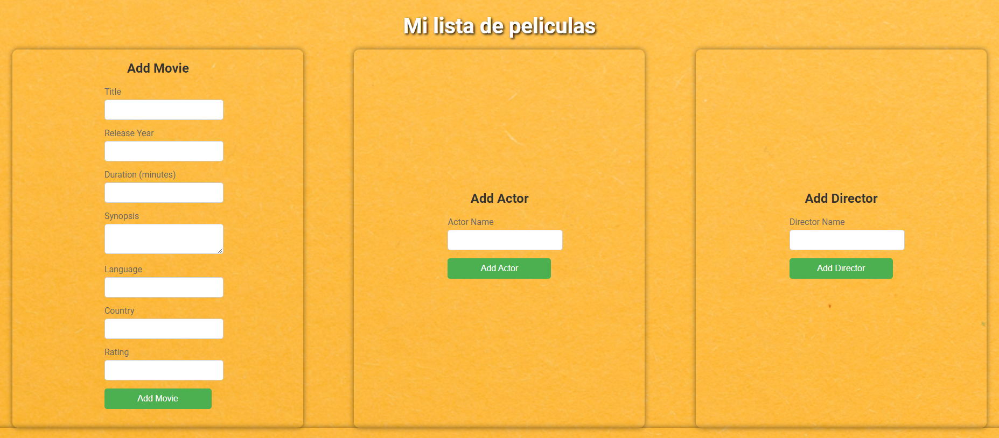

# Proyecto de Gestión de Películas
## Background
Mi nombre es Carlos Sanahuja
Mi background profesional no ha estado relacionado con la informática, pero tras una operación de espalda me comencé a reciclar profesionalmente y opté por la programación ya que es algo que me ha gustado desde siempre.
A partir de la operación de espalda he cursado los dos primeros trimestres de DAW y he realizado diversos cursos de html, CSS, Java y C+ en la plataforma Udemy.

## Imágenes de la web

## Descripción del Proyecto

Este proyecto es una aplicación web para la gestión de películas. Permite agregar películas a una base de datos, así como asignarles géneros, actores y directores. Además, se pueden añadir detalles adicionales como el presupuesto, la recaudación en taquilla y la duración de las películas. La aplicación permite consultar y visualizar la información de las películas en una interfaz sencilla.

## Rutas Habilitadas

1. **`/`**: Ruta principal
   - Muestra el formulario para agregar una película, así como formularios para añadir detalles de películas, actores y directores.
   - También muestra una lista de películas con sus detalles básicos.

2. **`/add_movie`**: Ruta para agregar una película
   - **Método**: `POST`
   - **Descripción**: Permite agregar una nueva película a la base de datos.

3. **`/add_details`**: Ruta para agregar detalles a una película
   - **Método**: `POST`
   - **Descripción**: Permite añadir detalles adicionales a una película existente, como géneros, actores, directores, presupuesto, recaudación en taquilla y duración.

4. **`/add_actor`**: Ruta para agregar un actor
   - **Método**: `POST`
   - **Descripción**: Permite añadir un nuevo actor a la base de datos.

5. **`/add_director`**: Ruta para agregar un director
   - **Método**: `POST`
   - **Descripción**: Permite añadir un nuevo director a la base de datos.

6. **`/movie_details/<int:movie_id>`**: Ruta para obtener los detalles de una película
   - **Método**: `GET`
   - **Descripción**: Devuelve los detalles adicionales de una película específica en formato JSON.

## Diagrama ER

El diagrama de entidades y relaciones (ER) de la base de datos es el siguiente:

## Funcionalidades de la Web

- **Agregar Películas**: Permite añadir nuevas películas con información básica.
- **Agregar Detalles a Películas**: Permite añadir detalles adicionales a una película, incluyendo géneros, actores, directores, presupuesto, recaudación en taquilla y duración.
- **Agregar Actores y Directores**: Permite añadir nuevos actores y directores a la base de datos.
- **Visualización de Películas**: Muestra una lista de películas con detalles básicos en una tabla.
- **Detalles Adicionales**: Permite ver detalles adicionales de una película mediante un botón "Details".

## Justificación de la Base de Datos

La base de datos está diseñada para almacenar y relacionar información de películas, géneros, actores y directores de manera eficiente. La estructura incluye tablas separadas para cada entidad principal y tablas intermedias para manejar las relaciones muchos a muchos (por ejemplo, `Movies_Genres`, `Movies_Actors`, `Movies_Directors`). Esta organización permite:
- **Escalabilidad**: Se pueden añadir nuevas entidades (como más géneros o actores) sin modificar la estructura existente.
- **Flexibilidad**: Es fácil relacionar una película con múltiples géneros, actores y directores.
- **Integridad**: Las tablas intermedias ayudan a mantener la integridad referencial entre las entidades.

## Tecnologías Utilizadas

- **Backend**: Flask (Python)
- **Base de Datos**: MySQL
- **Frontend**: HTML, CSS, JavaScript
